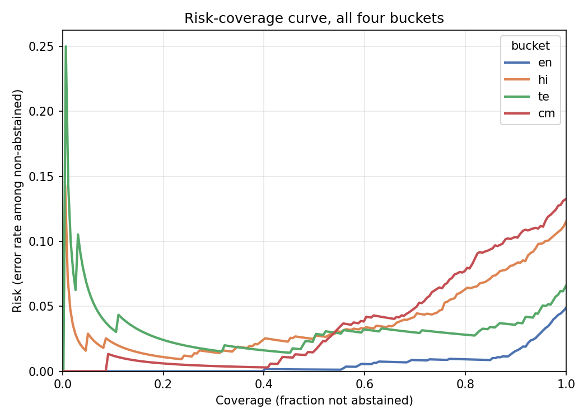
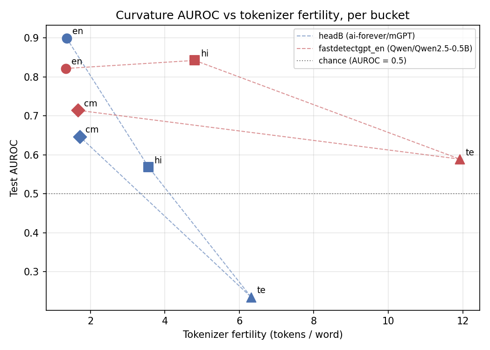

# Results — corpus v2, whitespace-normalised scoring

Everything below is computed on the frozen v2 corpus (`data/processed/splits.json`, 12,148 rows; generators qwen7b/gemma/mistral seen, llama held-out) with **every score column computed on whitespace-normalised text** (decisions.md 2026-09-30): headA, headB, headB_word, headC, fastdetectgpt_en, ppl and binoculars all in `results/norm/scores.parquet`. The fusion, per-bucket temperature and per-bucket conformal thresholds are fit on train / train / human-only cal and never see test. Reproduce with:

```
C=configs/models_norm.yaml
python -m src.eval.score --config $C --scores results/norm/scores_gpu.parquet --column binoculars
python -m scripts.merge_norm_scores --config $C          # headA + gpu columns -> results/norm/scores.parquet
python -m experiments.exp04_fusion --config $C           # fuser (webapp), coefficients
python -m experiments.exp01_baselines --config $C        # T1
python -m experiments.exp08_ablation --config $C         # T2
python -m experiments.exp10_heldout --config $C          # T3
python -m experiments.exp07_fairness --config $C         # T5 (GPU: scores the unmatched humans)
python -m experiments.exp05_abstention --config $C       # T6, F1, coverage sweep
python -m experiments.exp09_fertility_curvature --config $C   # F2
python -m scripts.headA_surface_ablation --config configs/data.yaml --out-csv results/S1_headA_ablation.csv
python -m scripts.export_calibration --config $C         # results/calibration.json (webapp)
python -m scripts.build_results_readme                   # this file
```

## Read this first: what these numbers can and cannot claim

**Provenance confound.** Every human row is scraped, single-source-per-domain text (news, wiki, forum, chat); every machine row is a prompted generation. A nine-number surface probe (digit share, punctuation share, word length, …) still reaches AUROC 0.84-0.92 after normalisation (decisions.md 2026-09-30). So an AUROC here means "scraped human vs prompted generation", not "human vs machine writing", and is an upper bound on what the detector would do on real student essays. An independent human sample per bucket is the only clean test. **Held-out coverage is thin:** llama is the only held-out generator and it generates hi only, so en, te and cm have no held-out evaluation at all, and T1's seen-generator numbers there are same-generator numbers (non-negotiable #4). **Missing baselines:** the supervised XLM-R baseline was never built, and vanilla DetectGPT was dropped for Fast-DetectGPT (decisions.md 2026-09-18), so T1 has three zero-shot baselines, not five. **T4 (adversarial)** is not part of this rebuild. The test split's hi bucket mixes seen and llama machine rows; T1 gives both breakdowns.

## Head C: diagnostic only

Head C (MuRIL embeddings) scores highest in T1 (en 1.000, te 0.999, hi 0.978 and 0.961 on held-out llama) and is **excluded from the fusion and from every calibrated output**. A plain TF-IDF classifier matches it on held-out llama hi (0.911-0.921) and across held-out generators and domains, so the held-out test cannot separate a real signal from the provenance difference above (decisions.md 2026-09-30; `results/headc_diagnosis_v2.txt`). It is reported in T1/T2/T3 as a diagnostic row, and `A+B+C` in T2 is reference only. The older [headc_diagnosis.md](headc_diagnosis.md) is the v1 single-generator analysis.

## Fusion

Logistic regression over `[headA, headB, bucket one-hot]`, standardised inputs, fit on the v2 train split and saved to `results/models/fuser_ab.joblib` (the webapp loads it; `services.analyse_text` runs end to end again). Standardised weights: headA 3.63, headB 0.33, bucket en 0.43 / hi 0.04 / te 0.03 / cm -0.58. Head A carries the model; headB gets a single global weight, and since headB is inverted on hi/te (T1) while positive on en/cm, one weight cannot use it in every bucket. Head A is per-bucket logistic fit on train, so the fuser sees in-sample Head A scores on train (train AUROC 0.96-0.995 vs test 0.93-0.99); this is inherited from the v1 design and not changed here.

## T1 — main results, per bucket, all methods

Test AUROC and F1 per bucket for the three zero-shot baselines (ppl, binoculars, fastdetectgpt_en), the heads (headA, headB, headB_word, headC-diagnostic) and the adopted fusion. `auroc` is over all test rows; `auroc_seen` drops llama; `auroc_heldout` is human-vs-llama (hi only). F1's threshold is tuned on train per bucket per method and applied unchanged to test.

Fusion AUROC: en 0.989, hi 0.961, te 0.963, cm 0.928; best zero-shot baseline: en 0.901 (ppl), hi 0.843 (fastdetectgpt_en), te 0.832 (ppl), cm 0.748 (ppl). Fusion beats every baseline in every bucket, but **it does not clearly beat Head A alone**: headA is en 0.986, hi 0.960, te 0.973, cm 0.928, so fusion adds +0.003 on en and ~0 on hi and cm and is 0.010 *worse* on te. The contribution of Head B here is small. Head B (curvature) is strong on en (0.900), weak on cm (0.647) and **inverted on seen-generator hi (0.336) and te (0.235)** — machine text scores as *less* curved than human under mGPT; on held-out llama hi it is 0.785, so the inversion is generator-specific rather than a property of Hindi (see F2, T3). cm is the weakest bucket for every method.

| bucket | method | n_human | n_machine | auroc | auroc_seen | auroc_heldout | f1 | f1_threshold |
| --- | --- | --- | --- | --- | --- | --- | --- | --- |
| en | ppl | 402 | 1091 | 0.901 | 0.901 |  | 0.923 | -2.920 |
| en | binoculars | 402 | 1091 | 0.840 | 0.840 |  | 0.873 | -0.047 |
| en | fastdetectgpt_en | 402 | 1091 | 0.822 | 0.822 |  | 0.869 | -0.573 |
| en | headA | 402 | 1091 | 0.986 | 0.986 |  | 0.965 | 0.357 |
| en | headB | 402 | 1091 | 0.900 | 0.900 |  | 0.901 | -0.585 |
| en | headB_word | 402 | 1091 | 0.886 | 0.886 |  | 0.889 | -0.554 |
| en | headC | 402 | 1091 | 1.000 | 1.000 |  | 0.969 | 0.964 |
| en | fused (A+B) | 402 | 1091 | 0.989 | 0.989 |  | 0.966 | 0.435 |
| hi | ppl | 449 | 923 | 0.838 | 0.786 | 0.887 | 0.846 | -1.510 |
| hi | binoculars | 449 | 923 | 0.839 | 0.755 | 0.917 | 0.843 | 0.051 |
| hi | fastdetectgpt_en | 449 | 923 | 0.843 | 0.752 | 0.927 | 0.833 | -0.253 |
| hi | headA | 449 | 923 | 0.960 | 0.973 | 0.947 | 0.897 | 0.581 |
| hi | headB | 449 | 923 | 0.569 | 0.336 | 0.785 | 0.804 | -12.322 |
| hi | headB_word | 449 | 923 | 0.573 | 0.349 | 0.781 | 0.805 | -26.847 |
| hi | headC | 449 | 923 | 0.978 | 0.997 | 0.961 | 0.841 | 0.959 |
| hi | fused (A+B) | 449 | 923 | 0.961 | 0.969 | 0.953 | 0.897 | 0.656 |
| te | ppl | 397 | 225 | 0.832 | 0.832 |  | 0.653 | -1.143 |
| te | binoculars | 397 | 225 | 0.630 | 0.630 |  | 0.551 | -0.012 |
| te | fastdetectgpt_en | 397 | 225 | 0.589 | 0.589 |  | 0.526 | -2.323 |
| te | headA | 397 | 225 | 0.973 | 0.973 |  | 0.912 | 0.561 |
| te | headB | 397 | 225 | 0.235 | 0.235 |  | 0.531 | -18.166 |
| te | headB_word | 397 | 225 | 0.229 | 0.229 |  | 0.529 | -18.224 |
| te | headC | 397 | 225 | 0.999 | 0.999 |  | 0.929 | 0.977 |
| te | fused (A+B) | 397 | 225 | 0.963 | 0.963 |  | 0.910 | 0.485 |
| cm | ppl | 597 | 232 | 0.748 | 0.748 |  | 0.544 | -5.295 |
| cm | binoculars | 597 | 232 | 0.668 | 0.668 |  | 0.480 | -0.259 |
| cm | fastdetectgpt_en | 597 | 232 | 0.714 | 0.714 |  | 0.480 | -0.244 |
| cm | headA | 597 | 232 | 0.928 | 0.928 |  | 0.765 | 0.663 |
| cm | headB | 597 | 232 | 0.647 | 0.647 |  | 0.456 | -0.508 |
| cm | headB_word | 597 | 232 | 0.625 | 0.625 |  | 0.453 | -0.824 |
| cm | headC | 597 | 232 | 0.953 | 0.953 |  | 0.758 | 0.961 |
| cm | fused (A+B) | 597 | 232 | 0.928 | 0.928 |  | 0.766 | 0.461 |

## T2 — ablation

A / B / C / A+B / A+B+C / +temperature / +conformal / +abstain, per bucket, test split. `+temperature` has AUROC/F1 identical to `A+B` by construction (a monotone transform cannot change ranking); its effect is in T6. `+conformal` is the per-bucket alpha=0.05 threshold with no abstention: FPR lands at en 0.052, hi 0.045, te 0.050, cm 0.034. `+abstain` is the three-way gate (MACHINE above the alpha=0.01 per-bucket tau, HUMAN below the human calibration median, ABSTAIN between): coverage en 0.73, hi 0.45, te 0.37, cm 0.69; accuracy on the covered rows 0.994, 0.982, 0.974, 0.953; FPR 0.018, 0.016, 0.016, 0.011. Coverage is lowest in te and hi, where the gate abstains on more than half of the test rows. `A+B+C` is reference only.

| bucket | config | auroc | f1 | fpr | coverage | accuracy |
| --- | --- | --- | --- | --- | --- | --- |
| cm | A | 0.928 | 0.765 |  | 1.000 |  |
| cm | B | 0.647 | 0.456 |  | 1.000 |  |
| cm | C | 0.953 | 0.758 |  | 1.000 |  |
| cm | A+B | 0.928 | 0.765 |  | 1.000 |  |
| cm | A+B+C | 0.958 | 0.816 |  | 1.000 |  |
| cm | +temperature | 0.928 | 0.765 |  | 1.000 |  |
| cm | +conformal | 0.928 | 0.608 | 0.034 | 1.000 | 0.829 |
| cm | +abstain |  |  | 0.011 | 0.689 | 0.953 |
| en | A | 0.986 | 0.965 |  | 1.000 |  |
| en | B | 0.900 | 0.901 |  | 1.000 |  |
| en | C | 1.000 | 0.969 |  | 1.000 |  |
| en | A+B | 0.989 | 0.966 |  | 1.000 |  |
| en | A+B+C | 0.999 | 0.995 |  | 1.000 |  |
| en | +temperature | 0.989 | 0.966 |  | 1.000 |  |
| en | +conformal | 0.989 | 0.963 | 0.052 | 1.000 | 0.946 |
| en | +abstain |  |  | 0.018 | 0.730 | 0.994 |
| hi | A | 0.960 | 0.897 |  | 1.000 |  |
| hi | B | 0.569 | 0.804 |  | 1.000 |  |
| hi | C | 0.978 | 0.841 |  | 1.000 |  |
| hi | A+B | 0.961 | 0.909 |  | 1.000 |  |
| hi | A+B+C | 0.983 | 0.923 |  | 1.000 |  |
| hi | +temperature | 0.961 | 0.909 |  | 1.000 |  |
| hi | +conformal | 0.961 | 0.887 | 0.045 | 1.000 | 0.861 |
| hi | +abstain |  |  | 0.016 | 0.447 | 0.982 |
| te | A | 0.973 | 0.912 |  | 1.000 |  |
| te | B | 0.235 | 0.531 |  | 1.000 |  |
| te | C | 0.999 | 0.929 |  | 1.000 |  |
| te | A+B | 0.963 | 0.907 |  | 1.000 |  |
| te | A+B+C | 0.999 | 0.980 |  | 1.000 |  |
| te | +temperature | 0.963 | 0.907 |  | 1.000 |  |
| te | +conformal | 0.963 | 0.906 | 0.050 | 1.000 | 0.932 |
| te | +abstain |  |  | 0.016 | 0.371 | 0.974 |

## T3 — held-out generator (llama, hi)

The new table. Same human test rows, machine side either the seen generators (qwen7b, gemma, mistral) or the held-out llama; 95% bootstrap CIs. **Fused AUROC 0.969 seen -> 0.953 held-out** (drop 0.015, CIs [0.957, 0.980] and [0.942, 0.965] overlap substantially); Head A 0.973 -> 0.947. So the stylometric head and the fusion generalise to llama with a small drop. The three zero-shot baselines go the *other way*: ppl 0.786 -> 0.887, binoculars 0.755 -> 0.917, fastdetectgpt_en 0.752 -> 0.927, and Head B 0.336 -> 0.785 (still below the fusion, no longer inverted). llama's Hindi is simply easier for likelihood-based scores than the seen generators' — a reminder that one held-out generator is one draw, not a general claim. Head C (diagnostic) drops 0.997 -> 0.961 and is matched by TF-IDF, so its held-out number is not evidence of generalisation.

**Operating point on llama** (the shipped gate, per-bucket tau fit on human cal only): at alpha=0.01 the gate flags 46.1% of llama hi text MACHINE vs 31.1% of seen-generator text, at a human FPR of 0.9%; at alpha=0.05, 75.4% vs 88.1% at FPR 4.5%. The three-way gate sends 53% of llama text to ABSTAIN and only 0.6% to HUMAN (seen: 68% abstain, 0.9% HUMAN): on unseen-generator text the error mode is abstaining, not wrongly clearing it as human. The FPR guarantee is on human text and does not depend on the generator; detection rate does, and at alpha=0.01 it is low.

| bucket | method | n_human | n_machine_seen | n_machine_heldout | auroc_seen | auroc_heldout | drop |
| --- | --- | --- | --- | --- | --- | --- | --- |
| hi | ppl | 449 | 444 | 479 | 0.786 | 0.887 | -0.101 |
| hi | binoculars | 449 | 444 | 479 | 0.755 | 0.917 | -0.162 |
| hi | fastdetectgpt_en | 449 | 444 | 479 | 0.752 | 0.927 | -0.175 |
| hi | headA | 449 | 444 | 479 | 0.973 | 0.947 | 0.027 |
| hi | headB | 449 | 444 | 479 | 0.336 | 0.785 | -0.450 |
| hi | headB_word | 449 | 444 | 479 | 0.349 | 0.781 | -0.432 |
| hi | headC (diagnostic) | 449 | 444 | 479 | 0.997 | 0.961 | 0.036 |
| hi | fused (A+B) | 449 | 444 | 479 | 0.969 | 0.953 | 0.015 |

Per generator (hi):

| generator | fused (A+B) | headA | headB |
| --- | --- | --- | --- |
| gemma | 0.958 | 0.956 | 0.814 |
| llama | 0.953 | 0.947 | 0.785 |
| mistral | 0.968 | 0.971 | 0.119 |
| qwen7b | 0.975 | 0.984 | 0.159 |

Gate behaviour (hi):

| bucket | alpha | group | n | tau | flag_rate_at_tau | frac_human | frac_abstain | frac_machine |
| --- | --- | --- | --- | --- | --- | --- | --- | --- |
| hi | 0.010 | human | 449.000 | 0.974 | 0.009 |  |  |  |
| hi | 0.010 | machine_seen | 444.000 | 0.974 | 0.311 |  |  |  |
| hi | 0.010 | machine_heldout | 479.000 | 0.974 | 0.461 |  |  |  |
| hi | 0.050 | human | 449.000 | 0.737 | 0.045 |  |  |  |
| hi | 0.050 | machine_seen | 444.000 | 0.737 | 0.881 |  |  |  |
| hi | 0.050 | machine_heldout | 479.000 | 0.737 | 0.754 |  |  |  |
| hi | 0.010 | human (3-way gate) |  |  |  | 0.541 | 0.450 | 0.009 |
| hi | 0.010 | machine_seen (3-way gate) |  |  |  | 0.009 | 0.680 | 0.311 |
| hi | 0.010 | machine_heldout (3-way gate) |  |  |  | 0.006 | 0.532 | 0.461 |

## T5 — fairness

FPR on human test text, conformal threshold per bucket (the adopted policy) vs one global threshold pooled over all four buckets' calibration scores (shown only for comparison). Per-bucket FPR at alpha=0.01: en 0.010, hi 0.009, te 0.008, cm 0.008; at alpha=0.05: en 0.052, hi 0.045, te 0.050, cm 0.034. Every bucket is at or below alpha except en (0.052) and te (0.050) at alpha=0.05, which is sampling noise on ~400 humans. With the global tau the FPR spreads out: en 0.020, hi 0.007, te 0.013, cm 0.000 at 0.01 and en 0.047, hi 0.038, te 0.025, cm 0.050 at 0.05. At 0.01 the pooled threshold flags en humans at twice alpha (0.020) and cm humans not at all; at 0.05 it over-flags cm (0.050 vs 0.034) and under-flags te (0.025 vs 0.050). The per-bucket threshold removes that spread; the effect is modest here because the four buckets' calibrated human score distributions are not far apart.

**en by writer_L1_band.** The expected direction (Indian-English writers flagged more) is **not** seen: at alpha=0.05 FPR is 0.085 for `general` (n=212) and 0.016 for `indian` (n=190); at 0.01, 0.014 vs 0.005. The disparity (indian minus general) is negative, and `general` exceeds alpha at both levels (0.085 at 0.05, 0.014 at 0.01), which the conformal bound does not cover per band because the cal split mixes both bands. The two bands are also different text sources, so this is not a clean L1 vs L2 contrast; treat it as "no evidence of the Liang et al. effect here", not as evidence of its absence.

**Unmatched-human robustness check.** The human rows that length matching trimmed out of the corpus (en 388, hi 266, te 366; cm trims machine so has none) were scored with headA + mGPT (whitespace-normalised) and pushed through the same fuser, temperature and tau. FPR with per-bucket tau at alpha=0.01: en 0.003, hi 0.008, te 0.003; at 0.05: en 0.059, hi 0.041, te 0.044. These are at or below alpha except en at 0.05 (0.059 vs 0.052 on matched, a small excess), so the rows the length matching discarded are not flagged materially more than the matched ones. Median lengths differ from matched test humans (en 213 vs 200, hi 142 vs 171, te 209 vs 151 words), so this also covers a range of lengths.

| alpha | bucket | group | n_human | fpr_per_bucket_tau | fpr_global_tau | tau_per_bucket | tau_global | median_length_words | matched_median_length_words |
| --- | --- | --- | --- | --- | --- | --- | --- | --- | --- |
| 0.010 | en | all | 402.000 | 0.010 | 0.020 | 0.995 | 0.976 |  |  |
| 0.010 | hi | all | 449.000 | 0.009 | 0.007 | 0.974 | 0.976 |  |  |
| 0.010 | te | all | 397.000 | 0.008 | 0.013 | 0.983 | 0.976 |  |  |
| 0.010 | cm | all | 597.000 | 0.008 | 0.000 | 0.871 | 0.976 |  |  |
| 0.010 | en | writer_L1_band=general | 212.000 | 0.014 | 0.028 | 0.995 | 0.976 |  |  |
| 0.010 | en | writer_L1_band=indian | 190.000 | 0.005 | 0.011 | 0.995 | 0.976 |  |  |
| 0.050 | en | all | 402.000 | 0.052 | 0.047 | 0.707 | 0.776 |  |  |
| 0.050 | hi | all | 449.000 | 0.045 | 0.038 | 0.737 | 0.776 |  |  |
| 0.050 | te | all | 397.000 | 0.050 | 0.025 | 0.417 | 0.776 |  |  |
| 0.050 | cm | all | 597.000 | 0.034 | 0.050 | 0.819 | 0.776 |  |  |
| 0.050 | en | writer_L1_band=general | 212.000 | 0.085 | 0.075 | 0.707 | 0.776 |  |  |
| 0.050 | en | writer_L1_band=indian | 190.000 | 0.016 | 0.016 | 0.707 | 0.776 |  |  |
| 0.010 | en | L1_L2_disparity (indian - general) |  | -0.009 | -0.018 |  |  |  |  |
| 0.050 | en | L1_L2_disparity (indian - general) |  | -0.069 | -0.060 |  |  |  |  |
| 0.010 | en | unmatched_human_robustness_check | 388.000 | 0.003 | 0.026 | 0.995 | 0.976 | 213.000 | 200.000 |
| 0.010 | hi | unmatched_human_robustness_check | 266.000 | 0.008 | 0.004 | 0.974 | 0.976 | 142.000 | 171.000 |
| 0.010 | te | unmatched_human_robustness_check | 366.000 | 0.003 | 0.005 | 0.983 | 0.976 | 209.000 | 151.000 |
| 0.050 | en | unmatched_human_robustness_check | 388.000 | 0.059 | 0.059 | 0.707 | 0.776 | 213.000 | 200.000 |
| 0.050 | hi | unmatched_human_robustness_check | 266.000 | 0.041 | 0.038 | 0.737 | 0.776 | 142.000 | 171.000 |
| 0.050 | te | unmatched_human_robustness_check | 366.000 | 0.044 | 0.027 | 0.417 | 0.776 | 209.000 | 151.000 |

## T6 — calibration

ECE (15 equal-width bins on P(machine)) before and after per-bucket temperature scaling, on the test split, and accuracy at 50/70/90% coverage (keep the most confident rows, prediction at 0.5). **Temperature scaling does not help much here**: fitted temperatures are en 0.89, hi 1.03, te 0.81, cm 1.20, all near 1, and ECE moves en 0.026 -> 0.027, hi 0.081 -> 0.081, te 0.028 -> 0.037, cm 0.057 -> 0.051 — slightly better on cm, slightly worse on en, hi, te. The fuser's logistic output is already close to calibrated on train, so there is little for temperature to fix. **The calibration gap is generator shift, not temperature:** hi's ECE is 0.025 on seen-generator test rows but 0.076 with llama (rows `hi (seen only)` / `hi (held-out)` below); the fuser is under-confident on an unseen generator. Accuracy at 50/70/90% coverage: en 0.999/0.991/0.984; hi 0.974/0.957/0.917; te 0.974/0.970/0.964; cm 0.986/0.952/0.897. The `fpr_at_*` columns are computed on the human rows that happen to fall in the kept set, which is tiny at 50% coverage (en: 1.000 is a handful of rows) — do not read them. The four plain-bucket rows are the test split as T1 sees it (hi includes llama).

| bucket | temperature | ece_before | ece_after | accuracy_at_50pct | fpr_at_50pct | accuracy_at_70pct | fpr_at_70pct | accuracy_at_90pct | fpr_at_90pct |
| --- | --- | --- | --- | --- | --- | --- | --- | --- | --- |
| en | 0.894 | 0.026 | 0.027 | 0.999 | 1.000 | 0.991 | 0.125 | 0.984 | 0.032 |
| hi (seen only) | 1.033 | 0.028 | 0.025 | 0.980 | 0.013 | 0.976 | 0.020 | 0.959 | 0.037 |
| hi (held-out) | 1.033 | 0.080 | 0.076 | 0.978 | 0.011 | 0.951 | 0.025 | 0.899 | 0.041 |
| hi | 1.033 | 0.081 | 0.081 | 0.974 | 0.013 | 0.957 | 0.023 | 0.917 | 0.041 |
| te | 0.815 | 0.028 | 0.037 | 0.974 | 0.007 | 0.970 | 0.012 | 0.964 | 0.022 |
| cm | 1.201 | 0.057 | 0.051 | 0.986 | 0.000 | 0.952 | 0.013 | 0.897 | 0.071 |

## Abstention gate and coverage sweep

`abstention_coverage_sweep.csv` moves the HUMAN cutoff so coverage runs 30% -> 100% while MACHINE stays at the alpha=0.01 tau. Coverage counts MACHINE verdicts as covered, so it cannot fall below the MACHINE share: in en the MACHINE verdicts alone cover 59% of test rows, so the 30% and 50% targets return the same row (hi, te and cm reach 30%). At 100% coverage (every row gets HUMAN or MACHINE) accuracy is en 0.850, hi 0.586, te 0.691, cm 0.802 — the alpha=0.01 tau keeps FPR near 1% but leaves many machine texts below it, so abstention is what makes the output trustworthy, and the price is coverage. Thresholds: `conformal_thresholds.csv` (n=1000 human per bucket, global pooled n=4000): tau at 0.01 en 0.995, hi 0.974, te 0.983, cm 0.871, global 0.976; at 0.05 en 0.707, hi 0.737, te 0.417, cm 0.819, global 0.776. At 0.05 te's tau (0.417) is far below the global (0.776): te human scores sit lower, so the global threshold is stricter than te needs and gives up te detection without any FPR benefit the bucket requires.

## F1 — risk-coverage



Risk (error rate among non-abstained rows, prediction at 0.5) against coverage when rows are dropped in order of increasing confidence, all four buckets overlaid. Points: `F1_risk_coverage.csv`. Risk is lowest at low coverage in every bucket and rises as less confident rows are admitted; cm and hi rise earliest.

## F2 — tokenizer fertility vs Head B AUROC



Tokens per word of each scorer's tokenizer against its own curvature AUROC per bucket (mGPT for headB, Qwen2.5-0.5B for fastdetectgpt_en). headB en: 1.36 tok/word, AUROC 0.900; headB hi: 3.56 tok/word, AUROC 0.569; headB te: 6.32 tok/word, AUROC 0.235; headB cm: 1.71 tok/word, AUROC 0.647; fastdetectgpt_en en: 1.34 tok/word, AUROC 0.822; fastdetectgpt_en hi: 4.80 tok/word, AUROC 0.843; fastdetectgpt_en te: 11.92 tok/word, AUROC 0.589; fastdetectgpt_en cm: 1.67 tok/word, AUROC 0.714. Fertility does not explain the collapse: mGPT at hi (3.56) and Qwen at hi (4.80) give 0.569 and 0.843 respectively, i.e. the scorer with the worse fragmentation does *better* on hi. Head B's hi/te inversion is specific to mGPT on these generators (T3: 0.336 seen -> 0.785 on llama). The hi figures include llama rows.

## S1 — Head A ablation (supplementary)

Is Head A reducible to surface format? Test AUROC on normalised text, seen generators (and held-out llama on hi), for a 9-number surface probe, Head A with all 40 features, with 14 format-adjacent features removed (c1), with sentence-length features also removed (c2), and the 15 parser features alone. In en, hi and te Head A keeps 0.96-0.98 seen (0.93 on llama) with every format-adjacent feature removed, above the probe; **in cm it does not** (0.928 -> 0.806 / 0.748, below the probe's 0.913): cm Head A is mostly terminal punctuation and what an English parser makes of romanised text, and should not be presented as a stylometric result. cm terminal punctuation is kept as a real register difference and is a fairness risk for writers who punctuate every sentence (decisions.md 2026-09-30).

| bucket | variant | auroc_seen | auroc_heldout_llama |
| --- | --- | --- | --- |
| en | (a) 9-number surface probe | 0.918 |  |
| en | (b) Head A, all 40 | 0.986 |  |
| en | (c1) minus format-adjacent | 0.982 |  |
| en | (c2) c1 minus sent-length | 0.970 |  |
| en | syntax-only (15 parser) | 0.945 |  |
| hi | (a) 9-number surface probe | 0.836 | 0.713 |
| hi | (b) Head A, all 40 | 0.973 | 0.947 |
| hi | (c1) minus format-adjacent | 0.964 | 0.932 |
| hi | (c2) c1 minus sent-length | 0.942 | 0.916 |
| hi | syntax-only (15 parser) | 0.905 | 0.831 |
| te | (a) 9-number surface probe | 0.871 |  |
| te | (b) Head A, all 40 | 0.973 |  |
| te | (c1) minus format-adjacent | 0.962 |  |
| te | (c2) c1 minus sent-length | 0.942 |  |
| te | syntax-only (15 parser) | 0.855 |  |
| cm | (a) 9-number surface probe | 0.913 |  |
| cm | (b) Head A, all 40 | 0.928 |  |
| cm | (c1) minus format-adjacent | 0.806 |  |
| cm | (c2) c1 minus sent-length | 0.748 |  |
| cm | syntax-only (15 parser) | 0.708 |  |

## Superseded

`t3_preliminary.md` (v1 corpus, raw text, 367 length-matched llama rows) is replaced by T3 above; `headc_diagnosis.md` is the v1 single-generator diagnosis. Both are kept for the record.
