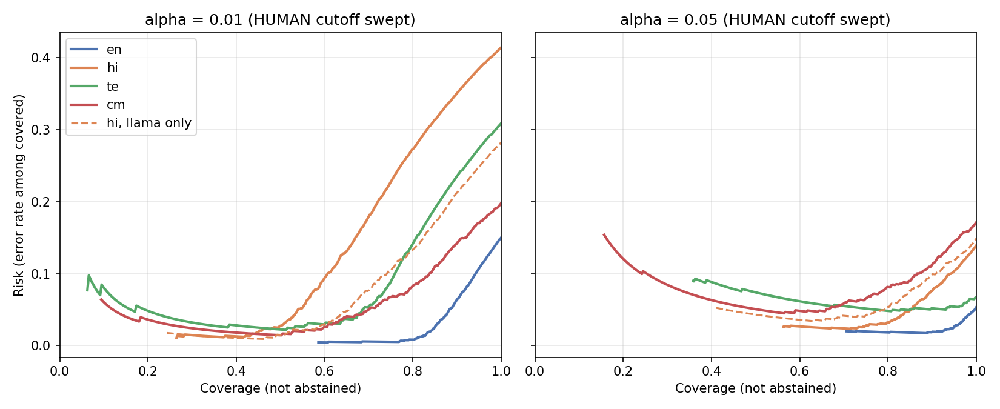

# Both operating points: alpha 0.01 and 0.05 (exp13)

Same fused_ab calibrated scores, per-bucket conformal tau for each alpha, shipped HUMAN cutoff (human calibration median). Reproduce: `python -m experiments.exp13_alpha_operating_points --config configs/models_norm.yaml`. `bound_p_value` is the exact one-sided binomial p-value for "true FPR > alpha" given the flags (small = evidence the bound is violated). Human rows are shared across the hi scopes, so hi FPR is identical in all three; only recall differs.

| bucket | scope | alpha | tau | fpr [95% Wilson] | bound_p_value | recall | gate_coverage | gate_false_clear | gate_machine_abstained | gate_accuracy_covered |
| --- | --- | --- | --- | --- | --- | --- | --- | --- | --- | --- |
| en | all test | 0.010 | 0.995 | 0.010 [0.004, 0.025] | 0.571 | 0.798 | 0.730 | 0.002 | 0.200 | 0.994 |
| en | all test | 0.050 | 0.707 | 0.052 [0.034, 0.079] | 0.450 | 0.946 | 0.849 | 0.002 | 0.052 | 0.982 |
| hi | all test | 0.010 | 0.974 | 0.009 [0.003, 0.023] | 0.657 | 0.389 | 0.447 | 0.008 | 0.603 | 0.982 |
| hi | seen only | 0.010 | 0.974 | 0.009 [0.003, 0.023] | 0.657 | 0.311 | 0.436 | 0.009 | 0.680 | 0.979 |
| hi | llama only | 0.010 | 0.974 | 0.009 [0.003, 0.023] | 0.657 | 0.461 | 0.508 | 0.006 | 0.532 | 0.985 |
| hi | all test | 0.050 | 0.737 | 0.045 [0.029, 0.068] | 0.732 | 0.815 | 0.745 | 0.008 | 0.178 | 0.974 |
| hi | seen only | 0.050 | 0.737 | 0.045 [0.029, 0.068] | 0.732 | 0.881 | 0.737 | 0.009 | 0.110 | 0.964 |
| hi | llama only | 0.050 | 0.737 | 0.045 [0.029, 0.068] | 0.732 | 0.754 | 0.676 | 0.006 | 0.240 | 0.963 |
| te | all test | 0.010 | 0.983 | 0.008 [0.003, 0.022] | 0.759 | 0.160 | 0.371 | 0.013 | 0.827 | 0.974 |
| te | all test | 0.050 | 0.417 | 0.050 [0.033, 0.077] | 0.518 | 0.902 | 0.667 | 0.013 | 0.084 | 0.945 |
| cm | all test | 0.010 | 0.871 | 0.008 [0.004, 0.019] | 0.712 | 0.315 | 0.689 | 0.095 | 0.591 | 0.953 |
| cm | all test | 0.050 | 0.819 | 0.034 [0.022, 0.051] | 0.979 | 0.474 | 0.752 | 0.095 | 0.431 | 0.933 |

## What relaxing 1% to 5% buys

| recall | alpha 0.01 | alpha 0.05 |
|---|---|---|
| en all test | 0.798 | 0.946 |
| hi all test | 0.389 | 0.815 |
| hi seen only | 0.311 | 0.881 |
| hi llama only | 0.461 | 0.754 |
| te all test | 0.160 | 0.902 |
| cm all test | 0.315 | 0.474 |

- **Recall:** en 0.80 -> 0.95, hi 0.39 -> 0.82, te 0.16 -> 0.90, cm 0.32 -> 0.47. The big gains are in hi and te, exactly the buckets where alpha 0.01 is unusable; cm gains least.
- **Held-out llama reverses:** at 0.01 llama is flagged more than seen generators (0.46 vs 0.31); at 0.05 less (0.75 vs 0.88). The llama gain is real (0.46 -> 0.75) but the seen-generator gain is larger, so the advantage of an easy generator disappears once tau relaxes. One held-out generator, so not a general claim.
- **Does the bound hold empirically at 0.05?** Point estimates: en 0.052, hi 0.045, te 0.050 (0.0504), cm 0.034. en (21/402) and te (20/397) are a hair above 0.05, and the binomial test gives no evidence of violation (p 0.45 en, 0.52 te); every Wilson interval contains 0.05. At 0.01 every bucket is at or below 0.01 (0.008-0.010). The bound is consistent with the data at both levels, but with ~400 human test rows per bucket it cannot distinguish 0.05 from 0.06; te and en sit on the boundary.
- **Gate (shipped HUMAN cutoff):** false clears do not change with alpha (same cutoff): en 0.2%, hi 0.8%, te 1.3%, cm 9.5%. What changes is machine text abstained: hi 60% -> 18%, te 83% -> 8%, en 20% -> 5%, cm 59% -> 43%. Coverage goes en 0.73 -> 0.85, hi 0.45 -> 0.75, te 0.37 -> 0.67, cm 0.69 -> 0.75. cm's false-clear rate of 9.5% is the one outstanding problem at either alpha (cm human median cutoff 0.133 is high; cm Head A is mostly surface form, decisions.md).
- **Accuracy on covered rows** falls modestly: en 0.994 -> 0.982, hi 0.982 -> 0.974, te 0.974 -> 0.945, cm 0.953 -> 0.933, because the 5% of humans flagged now count as errors.

## Risk-coverage per alpha

MACHINE fixed at tau_alpha, HUMAN cutoff swept; risk = error rate among covered rows (`exp13_risk_coverage_alpha.csv`). At alpha 0.01 the curves are flat and low (1-3%) up to about 50-60% coverage, then climb steeply in hi, te and cm because the remaining machine text sits below tau and is called HUMAN; at 100% coverage risk is hi 0.41, te 0.31, cm 0.20, en 0.15. At alpha 0.05 the curves are flatter: risk at 100% coverage falls to hi 0.14, te 0.07, cm 0.17, en 0.05, and at 80% coverage to hi 0.032, te 0.048, en 0.018, cm 0.081. The price is a risk floor near alpha (human flags count as errors): at low coverage 0.05 is worse than 0.01 (te 0.074 vs 0.023 at 50% coverage). The curves cross at roughly 60-70% coverage (read off the plot); above that alpha 0.05 is better in hi and te. On held-out llama hi (dashed): at 80% coverage risk is 0.134 at alpha 0.01 and 0.054 at 0.05 (all hi test, seen and llama mixed: 0.273 and 0.032).

## Reading for the paper trade-off

Recall at 1% FPR is poor in hi and te (0.39, 0.16) and the limit is tau, not abstention (exp12). At 5% FPR the same scores reach 0.82 and 0.90 recall with the bound still empirically holding, so the guarantee-vs-recall trade-off is steep and most of the useful operating range is at alpha near 0.05. Both points, not just 0.01, should be reported, and the claim at 0.05 should be stated as "consistent with", given the interval widths.
